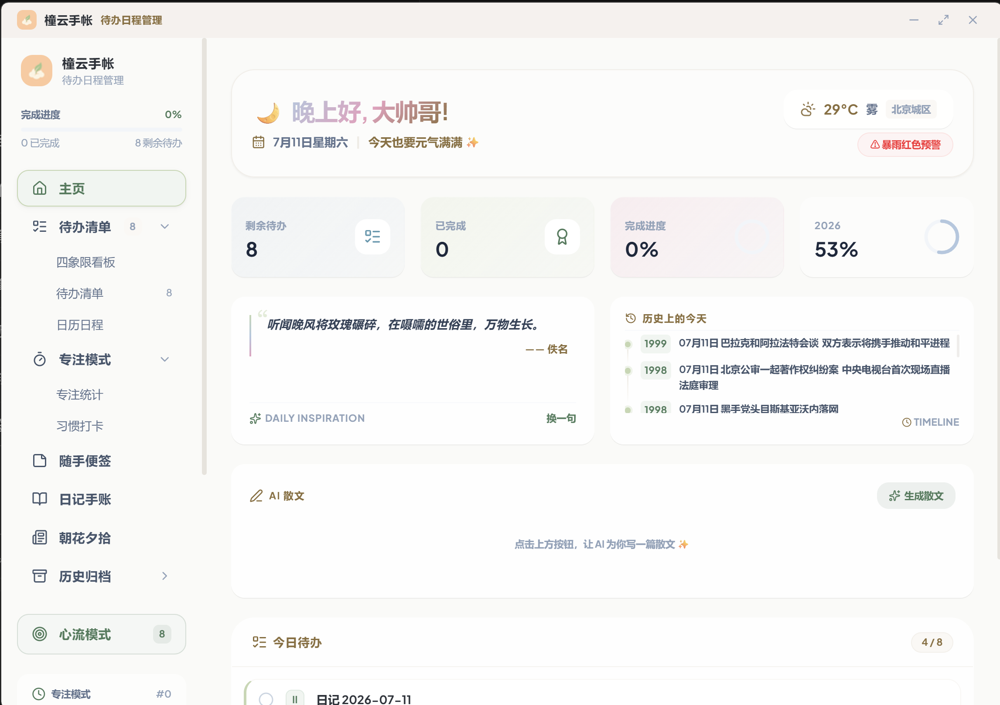

<div align="center">
  

  <h1 align="center">🍃 TongYun Planner · 橦云手账</h1>

  <p align="center">
    <strong>在纷繁世界里，为你留出一块温暖、安宁的心流角落</strong>
    <br />
    科学的时间管理 × 拟物手账美学 × 会回应你的 AI 老友
  </p>

  <p align="center">
    <a href="#-功能特性">功能特性</a> ·
    <a href="#-界面展示">界面展示</a> ·
    <a href="#%EF%B8%8F-技术栈">技术栈</a> ·
    <a href="#-开始使用">开始使用</a> ·
    <a href="#-项目结构">项目结构</a>
  </p>

  <p align="center">
    
    
    
    
    
    
    <br />
    
    
    
  </p>
</div>

---

**TongYun Planner（橦云手账）** 不仅是一个效率工具，更是你的**数字生活手账**。它将拟物化的纸面纹理、便签、翻页日记本（手账）和习惯打卡，与科学的四象限时间管理、白噪音及 AI 助手相融合，在纷繁的世界里为您留出一块温暖、安宁的心流角落。

从四象限矩阵到番茄钟专注，从桌面小组件到心流模式，从 AI 智能分类到全平台数据同步——每一处设计都极具温度，帮助你**更有序地梳理日常，更温柔地面对生活**。

---

### ✨ 为什么是橦云手账

- 📖 **把记录变成仪式** — 不是冷冰冰的表单，而是带书脊与横格的翻页日记本；每天一页，农历、心情、AI 暖评相伴，写完像合上一本真正的手账。
- 🔗 **让碎片流向行动** — 刷到的新闻、热榜、RSS 一键「稍后读 / 存为任务 / 收藏到日记」，信息不再看完就溜走，而是沉淀进你的待办与手账。
- 🤝 **有个会回应你的老友** — 内置「暖评」AI 读两遍你的日记，给出克制而真诚的回应；任务到期、每日建议、治愈散文，全程温柔陪伴而非催促。

---

## ✨ 功能特性

### 📋 四象限任务管理

基于**艾森豪威尔矩阵**（重要/紧急四象限）科学组织任务：

| 象限 | 分类 | 策略 |
|:---:|:---|:---:|
| **I** | 🔴 重要且紧急 | 立即处理 |
| **II** | 🟢 重要不紧急 | 计划安排 |
| **III** | 🔵 紧急不重要 | 委托他人 |
| **IV** | 🟡 不重要不紧急 | 尽量不做 |

- **矩阵视图** — 拖拽式四象限面板，一目了然
- **列表视图** — 带搜索/筛选/标签过滤的扁平列表
- **日历视图** — 月历 + 农历 + 节日标注 + 每日任务
- **甘特图视图** — 任务时间线可视化，掌握长期规划

### 🤖 AI 智能引擎

- **AI 智能收件箱** — 粘贴自然语言，AI 自动提取结构化任务（含日期、时间、象限分类）
- **自动归类** — 添加任务时 AI 自动推荐所属象限
- **任务分解** — 大任务一键拆解为 3-5 个可执行的子任务
- **标题润色** — AI 优化任务标题，更清晰准确
- **笔记格式化** — 杂乱的笔记一键整理
- **创意发散** — 基于笔记内容 AI 生成灵感建议
- **每日建议** — 根据今日任务 AI 生成优先级推荐
- **AI 散文** — 根据当前日期/季节自动生成治愈系散文
- **完成庆祝** — 任务完成时 AI 生成个性化的祝贺语
- **支持多模型** — OpenAI / DeepSeek / Anthropic Claude

### 🍅 番茄工作法

- **专注/休息** — 25/5 分钟默认周期（完全可自定义）
- **任务关联** — 为特定任务启动番茄钟
- **会话追踪** — 每次专注时长自动记录，关联任务
- **通知提醒** — 专注结束桌面推送通知
- **多窗口同步** — 主窗口与小组件番茄钟状态实时同步
- **自动切换** — 专注与休息模式自动流转

### 🌊 白噪音

- **8 种音效** — 布朗尼、粉红、海浪、雨声、白噪音、篝火、溪流、微风
- **音量调节** — 可自由调节
- **零资源占用** — 基于 Web Audio API 程序化生成，无需音频文件

### 🪟 桌面小组件

- **独立窗口** — 300×400，置顶显示，毛玻璃透明背景
- **5 种显示模式** — 卡片视图 / 列表视图 / 快速添加 / 番茄钟 / 便签
- **锁定/穿透模式** — 鼠标点击可穿透，不影响桌面操作
- **任务管理** — 完成、稍后提醒、收藏、添加任务
- **实时同步** — 与主应用状态实时同步

### 📌 便签功能

- **多种颜色** — 茶色、玫瑰、薄荷、薰衣草、天空蓝
- **随机旋转** — 模拟真实便签的自然摆放
- **装饰图钉** — 图钉 / 胶带 / 回形针 / 爱心 / 笑脸 五种样式
- **AI 强化** — AI 格式化 / AI 创意发散
- **浮动窗口** — 固定便签到桌面成为独立置顶窗口
- **搜索** — 快速查找便签内容

### 📊 专注分析看板

- **核心指标** — 总专注时长、总会话数、日均专注、连续天数
- **热力图** — 18 周专注热力图，直观展示专注模式
- **任务分布** — 各象限完成任务的饼图统计
- **任务专注拆解** — 每项任务的番茄钟投入统计
- **月度趋势** — 逐月对比分析
- **AI 报告** — 自动生成本周/本日专注报告与建议

### 🏠 智能仪表盘

- **时段问候** — 根据早/午/晚自动切换渐变问候语
- **今日任务** — 今日待办一目了然
- **城市天气** — 可配置城市实时天气
- **AI 散文** — 每日一篇 AI 生成的治愈系散文
- **今日历史** — 历史上的今天
- **每日一言** — 随机名言警句

### 🎯 心流模式

- **全屏沉浸** — 隐藏侧边栏，一次专注一项任务
- **自动流转** — 完成 → 下一项 → 全部完成
- **进度跟踪** — 剩余任务数实时显示

### 📰 资讯中心（朝花夕拾）

一个聚合式阅读空间，把碎片化信息变成可沉淀的行动：

- **五大视图** — 热榜（Trending）/ RSS 订阅 / GitHub 动态 / 视野（Explore）/ 稍后读（书签），可搜索切换
- **RSS / Atom** — 内置订阅源解析，Rust 后端代理绕过 CORS 限制
- **报纸风格阅读器** — 复古排版，支持字号（小/中/大/特大）、衬线/无衬线字体、单栏/双栏自由切换
- **AI 摘要** — 一键生成文章要点摘要，长文速读
- **阅读历史** — 自动记录最近 100 条阅读轨迹
- **资讯 → 行动联动** — 每条资讯一键「稍后读 / 存为任务 / 收藏到日记」，把看到的内容直接转化为待办与手账
- **缓存与重试** — 列表 30 分钟本地缓存 + 失败自动重试，弱网更稳

### 📖 翻页日记本（手账）

取代原本简单的「心情日记」，是一本金色质感的**翻页日记本**，专注书写本身的沉浸感：

- **双模式** — 日记（按日期翻页）/ 随记（笔记卡片网格），左侧目录切换
- **翻页仪式感** — 每日一页 + 左右翻页箭头（±1 天）、回到今天、未来日标记，纸张书脊装订质感
- **日期滑条** — 顶部横滑日期条（过去 60 天 ~ 未来 7 天），有日记的日子点亮圆点，点击跳天
- **页眉信息** — 大日期 + 星期 + 农历（lunar-javascript）+ 当日心情 emoji
- **纯文字书写** — 所见即所得的衬线横格文本框，去除 Markdown 干扰，书写即记录
- **AI 暖评** — 内置「暖评」老友角色，读两遍日记后给出克制而真诚的 3-5 句回应
- **# 标签浏览** — 自动聚合所有日记/随记中的 `#标签`，点击筛选、可清除
- **今日关联** — 按当前翻页日期联动展示当日任务 / 习惯 / 番茄，日记与日常不割裂
- **Markdown 导出** — 单篇导出或整本合并导出 `.md`，纯前端实现零后端依赖
- **心情记录** — 复用按日期的心情评分（1-5）与图片附件，日记内直接记录查看

### 🔔 任务到期提醒

- **桌面系统通知** — 今日到期且有具体时间的未完成任务，到期前 15 分钟「即将截止」、到期 1 小时内「已到截止时间」自动推送
- **防重复** — 同一任务仅通知一次，且仅主窗口触发，避免多窗口重复打扰
- **多语言** — 提醒文案随中 / 英语言切换

### ⏳ 更多工具

- **习惯打卡** — 每日习惯追踪打卡
- **倒数日** — 重要日期倒计时 / 已过天数
- **已完成归档** — 已完成任务历史 + 撤销完成

### 🤝 AI 智能体集成

- **WebDAV 工具定义** — 设置中心提供可直接复制给 AI 助手的 WebDAV 工具定义（含预填凭据、全部数据类型 schema、curl 示例），让 AI 助手能读写你的手账数据
- **manifest 版本管理** — 同步写入后自动维护 `manifest.json` 版本清单，保证多端同步可拉取

### 🎨 个性化定制

- **6 种主题色** — 蜜桃粉 · 抹茶绿 · 天空蓝 · 香芋紫 · 珊瑚橙 · 甘菊黄
- **5 种卡片背景** — 纯白 · 网格 · 横线 · 水彩 · 涂鸦
- **5 种图钉样式** — 图钉 · 胶带 · 回形针 · 爱心 · 笑脸
- **3 种字体** — 无衬线 · 圆体 · 衬线
- **3 种玻璃质感** — 透明 · 磨砂 · 实体
- **4 种水彩背景** — 绿洲 · 极光 · 晴日 · 无
- **日落模式** — 夜间自动暖色调护眼
- **深色模式** — 浅色 / 深色 / 跟随系统
- **完成庆祝** — 完成任务时五彩纸屑 + 祝贺动画

### ☁️ 数据同步

- **WebDAV** — 多文件增量同步（支持坚果云、Nextcloud 等）
- **Supabase** — 云端数据库同步
- **自动备份** — 15 秒~60 分钟可配置自动同步
- **版本冲突** — 基于时间戳的智能冲突解决
- **快照导入/导出** — 完整数据 JSON 导出与恢复
- **多窗口实时同步** — 主窗口 / 小组件 / 浮动便签 三者实时状态同步

### 🌐 国际化

- **简体中文 / English** 双语言完整支持
- 可扩展翻译框架

### ⌨️ 效率工具

- **Cmd/Ctrl+K 命令面板** — 快速导航与操作
- **系统托盘** — 最小化到托盘，后台运行
- **快捷操作** — 拖拽分类、快速添加、一键专注

---

## 📸 界面展示

> **截图指南：** 以下截图需要你运行应用后自行截取。具体的截图位置和建议如下：

### 1. 智能仪表盘
截取 `DashboardView` 组件渲染的主页，展示：
- 左上方的时段问候（渐变色文字）和日期
- 右上方的实时天气组件
- 四张统计小卡片（待办任务/已完成/今日进度/年度进度）
- 每日一言和"历史上的今天"
- AI 每日建议和 AI 散文区块
- 今日任务列表

> **截图位置：** 启动应用后默认显示的首页（`activeTab === "home"`）  
> **建议文件名：** `screenshots/dashboard.png`

### 2. 四象限矩阵视图
截取 `MatrixView` 组件，展示：
- 四个象限的完整布局，每个象限包含多个任务卡片
- 每个任务卡片的优先级别标识、截止日期、收藏/图钉图标
- 顶部的搜索栏

> **截图位置：** 点击侧边栏"任务"→"四象限"  
> **建议文件名：** `screenshots/matrix-view.png`

### 3. 日历视图
截取 `CalendarView` 组件，展示：
- 完整月历网格（农历日期标注）  
- 每日下方的任务圆点标记
- 选中某日后右侧/下方列出的当日任务列表
- 底部的快捷添加任务区域

> **截图位置：** 点击侧边栏"任务"→"日历"  
> **建议文件名：** `screenshots/calendar-view.png`

### 4. 专注分析看板
截取 `AnalyticsView` 组件，展示：
- 顶部统计卡片（总专注时长、会话数、日均专注、连续天数）
- 专注热力图
- 任务分布饼图 / 象限完成统计
- AI 专注报告区域

> **截图位置：** 点击侧边栏"专注"→"统计"  
> **建议文件名：** `screenshots/analytics.png`

### 5. 便签墙
截取 `StickyNotesView` 组件，展示：
- 多个不同颜色的便签卡片
- 每张便签的装饰图钉/胶带样式
- 便签的随机旋转效果

> **截图位置：** 点击侧边栏"便签"  
> **建议文件名：** `screenshots/sticky-notes.png`

### 6. 桌面小组件
截取 `WidgetWindow` 组件（独立窗口），展示：
- 小尺寸置顶窗口的外观
- 切换不同标签（卡片/列表/添加/番茄钟/便签）
- 推荐截取"卡片视图"或"番茄钟"模式

> **截图位置：** 点击侧边栏底部"小组件"按钮打开的独立窗口  
> **建议文件名：** `screenshots/widget.png`

### 7. 番茄钟 + 白噪音
截取 `Sidebar` 组件中番茄钟和白噪音区域，展示：
- 番茄钟计时器（显示时间、专注/休息状态、进度条）
- 白噪音选择网格（8 种音效按钮）
- 音量调节滑块和提醒声音选择

> **截图位置：** 侧边栏展开状态，找到番茄钟区域和白噪音区域  
> **建议文件名：** `screenshots/pomodoro.png`

### 8. 个性化设置
截取 `SettingsView` 组件，展示：
- 主题色选择（6 种预设色块）
- 主题预设卡片
- AI 配置区域（API Key、模型选择）
- WebDAV 同步设置
- 快照导入/导出功能

> **截图位置：** 点击侧边栏底部"设置"  
> **建议文件名：** `screenshots/settings.png`

### 9. 列表视图
截取 `ListView` 组件，展示：
- 扁平的任务列表
- 搜索栏和分类/标签筛选下拉框
- 每行任务卡片带优先级别标记、截止日期、收藏/编辑操作

> **截图位置：** 点击侧边栏"任务"→"列表"  
> **建议文件名：** `screenshots/list-view.png`

### 10. 翻页日记本（手账）
截取 `JournalView` 组件，展示：
- 纸张质感的一页日记，含书脊装订阴影与横格
- 顶部日期滑条（有日记的日子点亮圆点）
- 页眉大日期 + 星期 + 农历 + 心情 emoji
- 右侧「今日关联」（任务/习惯/番茄）与 AI 暖评区块
- 可切到「随记」模式展示卡片网格

> **截图位置：** 点击侧边栏"日记"（或手账入口）  
> **建议文件名：** `screenshots/journal.png`

### 11. 资讯中心
截取 `NewsView` 组件，展示：
- 顶部视图切换（热榜 / RSS / GitHub / 视野 / 稍后读）
- 报纸风格阅读列表或某篇文章的阅读器界面
- 资讯条目上的「稍后读 / 存为任务 / 收藏到日记」操作按钮

> **截图位置：** 点击侧边栏"资讯"（或阅读器入口）  
> **建议文件名：** `screenshots/news.png`

### 相册布局

将截图放入 `screenshots/` 目录后，可以这样组织展示（可根据实际截图选 6-8 张核心的）：

```markdown
| 仪表盘 | 四象限矩阵 | 日历视图 |
|:---:|:---:|:---:|
|  |  |  |
| **专注分析** | **桌面小组件** | **便签墙** |
|  |  |  |
| **番茄专注** | **个性化设置** | **列表视图** |
|  |  |  |
| **翻页日记本** | **资讯中心** |  |
|  |  |  |
```

---

## 🛠️ 技术栈

| 层级 | 技术 | 用途 |
|:---|:---|:---|
| **前端框架** | React 19 + TypeScript 5.8 | 现代化 UI 开发 |
| **构建工具** | Vite 7 | 极速 HMR 热更新 |
| **样式方案** | Tailwind CSS 4 | 原子化 CSS，响应式设计 |
| **动画引擎** | Framer Motion 12 | 流畅的交互动画 |
| **图标库** | Lucide React | 一致的高质量图标 |
| **桌面框架** | Tauri 2 | 跨平台桌面应用（Rust 后端） |
| **原生语言** | Rust 1.85 | 高性能系统级操作 |
| **数据持久化** | Tauri Store + SQLite | 双层持久化存储 |
| **云同步** | WebDAV / Supabase | 双引擎数据同步 |
| **AI 集成** | OpenAI / DeepSeek / Anthropic | 智能任务处理 |
| **音频引擎** | Web Audio API | 程序化白噪音 + 音效 |
| **农历支持** | lunar-javascript | 中国农历/节气计算 |
| **国际化** | 自研 Context 框架 | 中/英双语 |
| **状态管理** | React Hooks + Context | 轻量级状态管理 |

---

## 🚀 开始使用

### 环境要求

| 依赖 | 最低版本 | 说明 |
|:---|:---:|:---|
| Node.js | 18.0+ | JavaScript 运行时 |
| npm | 9.0+ | 包管理器 |
| Rust | 1.70+ | Tauri 后端编译 |
| Cargo | 1.70+ | Rust 包管理器 |

**系统额外依赖：**

- **Windows** — Microsoft Visual Studio C++ Build Tools
- **macOS** — Xcode Command Line Tools
- **Linux** — `sudo apt install libwebkit2gtk-4.1-dev libgtk-3-dev libayatana-appindicator3-dev librsvg2-dev`

### 安装与运行

```bash
# 1. 克隆项目
git clone https://gitee.com/your-username/tongyun-planner.git
cd tongyun-planner

# 2. 安装前端依赖
npm install

# 3. 启动开发模式（热更新 + Tauri 桌面窗口）
npm run tauri dev

# 4. 构建生产版本
npm run tauri build
```

### 可用脚本

| 命令 | 说明 |
|:---|:---|
| `npm run dev` | 启动前端开发服务器（浏览器） |
| `npm run build` | 构建前端静态资源 |
| `npm run tauri dev` | 启动 Tauri 桌面开发模式 |
| `npm run tauri build` | 构建桌面应用安装包 |
| `npm run typecheck` | TypeScript 类型检查 |
| `npm run check:rust` | Rust 代码检查（cargo check） |
| `npm run check` | 完整检查（前端 + 后端） |

---

## 📁 项目结构

```
tongyun-planner/
├── src/                          # 前端源码
│   ├── main.tsx                  # React 入口
│   ├── App.tsx                   # 主应用组件（状态聚合中枢）
│   ├── types.ts                  # 全部 TypeScript 类型定义
│   ├── constants.ts              # 全局常量 & AI 提示词
│   ├── index.css                 # 全局样式（1400+ 行，含暗色模式）
│   │
│   ├── components/               # 27 个 React 组件
│   │   ├── DashboardView.tsx     # 🏠 智能仪表盘
│   │   ├── MatrixView.tsx        # 📊 四象限矩阵
│   │   ├── ListView.tsx          # 📋 列表视图
│   │   ├── CalendarView.tsx      # 📅 日历（含农历）
│   │   ├── GanttView.tsx         # 📈 甘特图
│   │   ├── TaskDetailModal.tsx   # 📝 任务详情模态框
│   │   ├── QuickAddTask.tsx      # ⚡ 快速添加
│   │   ├── Sidebar.tsx           # 📌 侧边栏（含番茄钟 + 白噪音）
│   │   ├── AnalyticsView.tsx     # 📊 专注分析看板
│   │   ├── FlowMode.tsx          # 🎯 心流模式
│   │   ├── StickyNotesView.tsx   # 📌 便签墙
│   │   ├── WidgetWindow.tsx      # 🪟 桌面小组件
│   │   ├── FloatingNoteWindow.tsx# 🪟 浮动便签窗口
│   │   ├── HabitsView.tsx        # ✅ 习惯打卡
│   │   ├── MoodView.tsx          # 😊 心情日记
│   │   ├── CountdownView.tsx     # ⏳ 倒数日
│   │   ├── NewsView.tsx          # 📰 资讯中心
│   │   ├── JournalView.tsx       # 📖 翻页日记本（手账）
│   │   ├── SettingsView.tsx      # ⚙️ 设置中心
│   │   ├── CompletedView.tsx     # 🏁 已完成归档
│   │   ├── CommandPalette.tsx    # ⌨️ 命令面板
│   │   ├── CelebrationOverlay.tsx# 🎉 庆祝动画
│   │   ├── SwipeCard.tsx         # 👆 滑动手势卡片
│   │   ├── FocusHeatmap.tsx      # 🔥 专注热力图
│   │   ├── StickyPin.tsx         # 📍 装饰图钉
│   │   ├── TitleBar.tsx          # 🪟 自定义标题栏
│   │   ├── CustomSelect.tsx      # 🔽 自定义下拉框
│   │   └── ExploreView.tsx       # 🔍 探索视图
│   │
│   ├── hooks/                    # 8 个自定义 Hook
│   │   ├── useTasks.ts           # 任务 CRUD + 存储
│   │   ├── usePomodoro.ts        # 番茄钟状态机
│   │   ├── useAI.ts              # AI 输入/提取/分类
│   │   ├── useCustomization.ts   # 主题/配色/模式管理
│   │   ├── useStickyNotes.ts     # 便签增删改
│   │   ├── useCountdown.ts       # 倒数日管理
│   │   ├── useSync.ts            # 跨窗口同步
│   │   └── useWidget.ts          # 小组件窗口管理
│   │
│   ├── utils/                    # 工具模块
│   │   ├── aiEngine.ts           # AI 引擎（OpenAI/Anthropic）
│   │   ├── audioEngine.ts        # Web Audio 白噪音引擎
│   │   ├── storage.ts            # 存储层（localStorage + SQLite）
│   │   ├── webdav.ts             # WebDAV 客户端
│   │   ├── date.ts / dateParser.ts # 日期处理 & 自然语言解析
│   │   ├── rrule.ts              # 循环规则解析
│   │   ├── id.ts / json.ts       # 工具函数
│   │   └── sync/                 # 同步引擎
│   │       ├── types.ts          #  同步数据结构
│   │       ├── engine.ts         #  同步编排器
│   │       ├── webdavProvider.ts #  WebDAV 提供者
│   │       └── supabaseProvider.ts # Supabase 提供者
│   │
│   └── i18n/                     # 国际化
│       ├── zh-CN.ts              #   中文
│       ├── en.ts                 #   英文
│       └── LanguageContext.tsx    #   语言上下文
│
├── src-tauri/                    # Tauri Rust 后端
│   ├── src/
│   │   ├── main.rs               #  Rust 入口
│   │   └── lib.rs                #  核心命令（WebDAV、RSS 代理等）
│   ├── icons/                    #   应用图标
│   ├── capabilities/             #   权限配置
│   └── tauri.conf.json           #   Tauri 配置
│
├── screenshots/                  # 应用截图（空，需自行添加）
├── public/                       # 静态资源
├── package.json                  # 依赖配置
├── vite.config.ts                # Vite 配置
├── tsconfig.json                 # TypeScript 配置
├── tailwind.config.js            # Tailwind CSS 配置
│
├── README.md                     # 本文件
├── ARCHITECTURE.md               # 架构说明
├── CHANGELOG.md                  # 更新日志
├── ROADMAP.md                    # 开发路线图
├── FAQ.md                        # 常见问题
├── CONTRIBUTING.md               # 贡献指南
├── CODE_OF_CONDUCT.md            # 行为准则
├── SECURITY.md                   # 安全策略
├── SUPPORT.md                    # 支持渠道
└── LICENSE                       # MIT 许可证
```

---

## ⚙️ 配置说明

### 应用设置

在应用内 **设置页面** 可配置：

| 配置项 | 说明 |
|:---|:---|
| 🎨 **主题与样式** | 主题色、卡片背景、字体、玻璃质感、水彩背景 |
| 🌙 **日落模式** | 开启/关闭，自定义起止时间和暖色强度 |
| 🌓 **深色模式** | 浅色 / 深色 / 跟随系统 |
| 🤖 **AI 服务** | 选择提供商（OpenAI / DeepSeek / Claude），配置 API Key |
| ☁️ **WebDAV 同步** | 配置服务器地址、用户名、密码 |
| 📦 **Supabase 同步** | 配置 URL 和 Anon Key |
| 🔔 **提醒声音** | Beep / Cuckoo / Meow |
| 🗣️ **语言** | 中文 / English |
| 📤 **快照导入/导出** | 完整数据备份与恢复 |
| 🗑️ **恢复出厂** | 清除所有本地数据 |

### Tauri 配置 (`src-tauri/tauri.conf.json`)

- 应用标识：`com.tongyunplanner.app`
- 主窗口尺寸：1020 × 720，无边框设计
- 小组件窗口：300 × 400，置顶、透明、无任务栏

---

## 🤝 贡献指南

欢迎任何形式的贡献！详细指南请查看 [CONTRIBUTING.md](CONTRIBUTING.md)。

1. Fork 本仓库
2. 新建功能分支：`git checkout -b feature/your-feature`
3. 提交代码：`git commit -m 'Add some feature'`
4. 推送分支：`git push origin feature/your-feature`
5. 新建 Pull Request

### 代码规范

- **前端** — TypeScript 严格模式，`npm run typecheck` 类型检查
- **后端** — Rust 官方风格指南，`cargo fmt` + `cargo clippy`
- **提交信息** — 清晰描述变更内容

---

## 🗺️ 路线图

- 详细路线图请查看 [ROADMAP.md](ROADMAP.md)
- 当前版本：v0.1.0
- 目标版本：v1.0.0（预计 2027 年底）

---

## 📄 许可证

本项目基于 [MIT License](LICENSE) 开源。

---

## 💬 帮助与支持

- 常见问题：[FAQ.md](FAQ.md)
- 安全报告：[SECURITY.md](SECURITY.md)
- 支持渠道：[SUPPORT.md](SUPPORT.md)

---

<div align="center">
  <sub>Built with ❤️ using Tauri · React · Rust · TypeScript</sub>
  <br />
  <sub>✨ 本产品纯 <strong>Vibe coding</strong> 产物 ✨</sub>
  <br />
  <sub>© 2026 TongYun Planner. All rights reserved.</sub>
</div>
